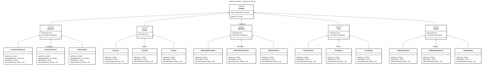

# Sistema de Pedidos - Diagrama de Classes

```mermaid
---
title: Sistema de Pedidos - Diagrama de Classes
config:
  theme: base
  themeVariables:
    primaryColor: '#ffffff'
    primaryTextColor: '#000000'
    primaryBorderColor: '#000000'
    lineColor: '#000000'
    secondaryColor: '#f8f8f8'
    tertiaryColor: '#ffffff'
    background: '#ffffff'
    mainBkg: '#ffffff'
    secondBkg: '#f8f8f8'
    tertiaryTextColor: '#000000'
---
classDiagram
    direction TB
    %% Base abstract class
    class Entidade {
        <<abstract>>
        +Map~String,String~ db_config
        +getpreco()* double
    }
    
    %% Abstract categories - organized in namespace
    namespace Categorias {
        class Sanduiche {
            <<abstract>>
            +String descricao
            +List~String~ ingredientes
        }
        
        class Bebida {
            <<abstract>>
            +String descricao
        }
        
        class Milkshake {
            <<abstract>>
            +String descricao
            +List~String~ ingredientes
        }
        
        class HotDog {
            <<abstract>>
            +String descricao
            +List~String~ ingredientes
        }
        
        class Pizza {
            <<abstract>>
            +String descricao
            +List~String~ ingredientes
        }
    }
    
    %% Concrete implementations organized by category
    namespace Sanduiches {
        class SanduicheTradicional {
            +getpreco() double
            +getingredientes() List~String~
            +getimagem() String
            +alteraritem(String, String) void
        }
        
        class SanduicheChicken {
            +getpreco() double
            +getingredientes() List~String~
            +getimagem() String
            +alteraritem(String, String) void
        }
        
        class SanduicheFish {
            +getpreco() double
            +getingredientes() List~String~
            +getimagem() String
            +alteraritem(String, String) void
        }
    }
    
    namespace Bebidas {
        class CocaCola {
            +getpreco() double
            +getimagem() String
            +alteraritem(String, String) void
        }
        
        class SucoVale {
            +getpreco() double
            +getimagem() String
            +alteraritem(String, String) void
        }
        
        class Guarana {
            +getpreco() double
            +getimagem() String
            +alteraritem(String, String) void
        }
    }
    
    namespace Milkshakes {
        class MilkshakeMoranguete {
            +getpreco() double
            +getimagem() String
            +alteraritem(String, String) void
        }
        
        class MilkshakeChocolatudo {
            +getpreco() double
            +getimagem() String
            +alteraritem(String, String) void
        }
        
        class MilkshakeKitKat {
            +getpreco() double
            +getimagem() String
            +alteraritem(String, String) void
        }
    }
    
    namespace Pizzas {
        class PizzaCalabresa {
            +getpreco() double
            +getimagem() String
            +alteraritem(String, String) void
        }
        
        class PizzaRicota {
            +getpreco() double
            +getimagem() String
            +alteraritem(String, String) void
        }
        
        class PizzaFrango {
            +getpreco() double
            +getimagem() String
            +alteraritem(String, String) void
        }
    }
    
    namespace HotDogs {
        class HotDogTradicional {
            +getpreco() double
            +getimagem() String
            +alteraritem(String, String) void
        }
        
        class HotDogNãoTradicional {
            +getpreco() double
            +getimagem() String
            +alteraritem(String, String) void
        }
        
        class HotDogFrango {
            +getpreco() double
            +getimagem() String
            +alteraritem(String, String) void
        }
    }
    
    %% Inheritance relationships
    Entidade <|-- Sanduiche
    Entidade <|-- Bebida
    Entidade <|-- Milkshake
    Entidade <|-- HotDog
    Entidade <|-- Pizza
    
    %% Sanduiche specializations
    Sanduiche <|-- SanduicheTradicional
    Sanduiche <|-- SanduicheChicken
    Sanduiche <|-- SanduicheFish
    
    %% Bebida specializations
    Bebida <|-- CocaCola
    Bebida <|-- SucoVale
    Bebida <|-- Guarana
    
    %% Milkshake specializations
    Milkshake <|-- MilkshakeMoranguete
    Milkshake <|-- MilkshakeChocolatudo
    Milkshake <|-- MilkshakeKitKat
    
    %% Pizza specializations
    Pizza <|-- PizzaCalabresa
    Pizza <|-- PizzaRicota
    Pizza <|-- PizzaFrango
    
    %% HotDog specializations
    HotDog <|-- HotDogTradicional
    HotDog <|-- HotDogNãoTradicional
    HotDog <|-- HotDogFrango
```